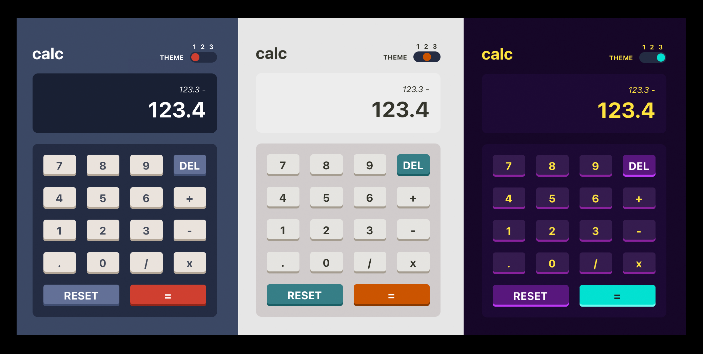
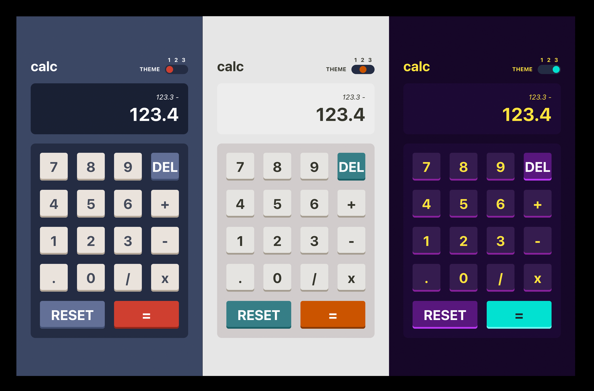

# Frontend Mentor - REST Countries API with color theme switcher solution

This is a solution to the [Calculator app](https://www.frontendmentor.io/challenges/calculator-app-9lteq5N29). Frontend Mentor challenges help you improve your coding skills by building realistic projects.

It's a 3-themed calculator app using React, Context, and useReducer.

## Overview

### The challenge

Users should be able to:

- See the size of the elements adjust based on their device's screen size
- Perform mathmatical operations like addition, subtraction, multiplication, and division
- Adjust the color theme based on their preference

### Screenshots

#### Desktop

#### Mobile

### Live deployment preview

## My process

### Built with

- React.js with context and useReducer
- SCSS and CSS modules

### What I learned

I learned about useReducer and how to structure for multiple color themes.
### Continued development

Going forward, I'll investigate more ways of structuring multiple-themed apps from a styling perspective.